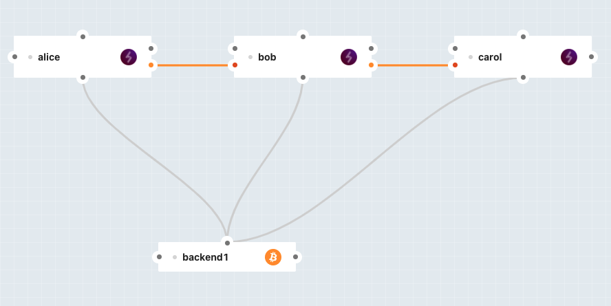

# Example - Intercepting HTLCs

This example will guide you though creating your first test Lightning Network with Polar, and how to give instructions to a node in said network.

The code of the script is already written, so your missions for that example exercise are to:

- build the Polar network,
- understand what the code in [index.js](index.ts) does.

You'll notice that we're using a package called `lightning`. It's written by [Alex Bosworth](https://github.com/alexbosworth) from [Lightning Labs](https://lightning.engineering/), and its code and documentation can be found [here](https://github.com/alexbosworth/lightning/).

## Designing the Network

Our goal here is to show how we can give instructions to a Lightning Node to only forward payments if they meet certain requirements, and fail them otherwise. We hence need at least 3 nodes in our network:

- Alice, which will send or receive payments,
- Bob, which will route payments (and to which are script will give instructions),
- Carol, which will send or receive payments as well.

Click to see a screenshot of what your network could look like.

Note that yours can be a bit different, that's okay as long as there are at least 3 nodes forming a route. Have fun!

Finally, our exercise require you to send payments between Alice and Carol. Since can be done directly in Polar's interface, by right-clicking on a node and selecting "Create Invoice" or "Pay Invoice".
